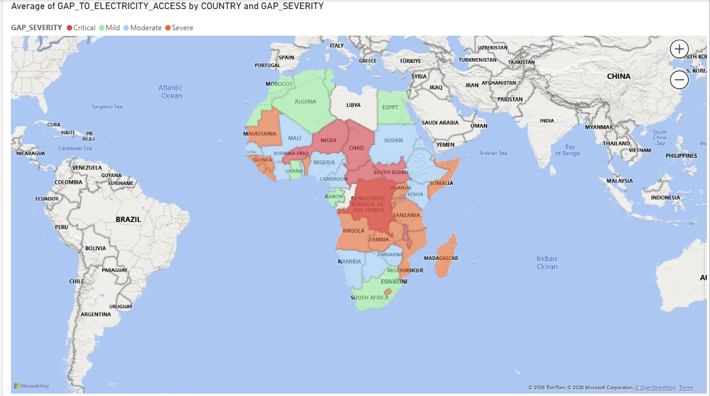
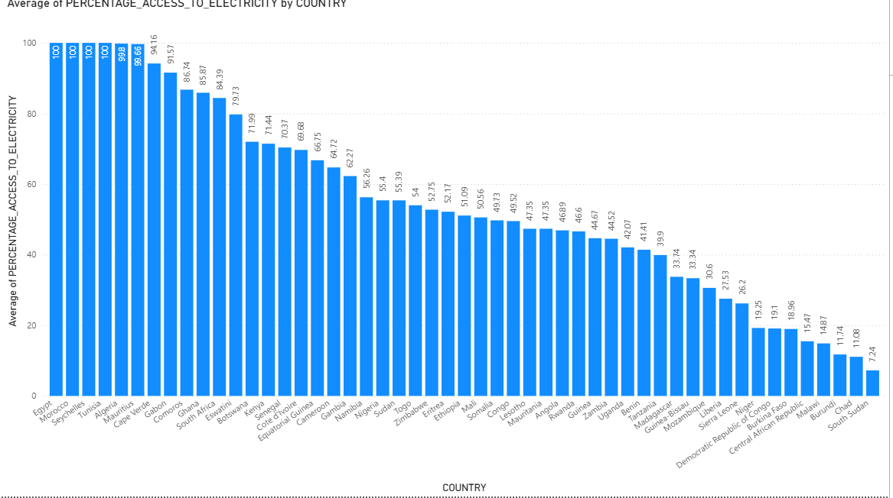
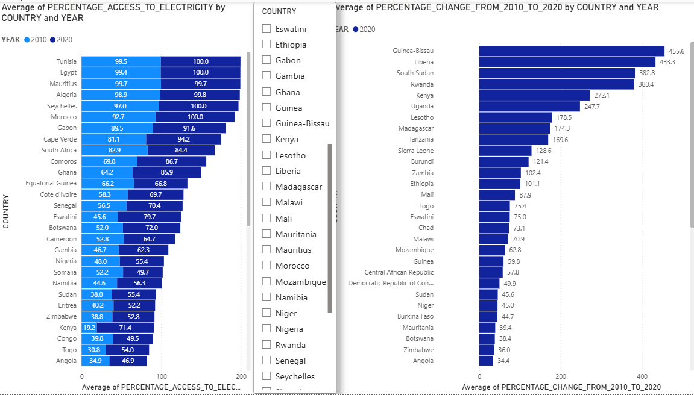
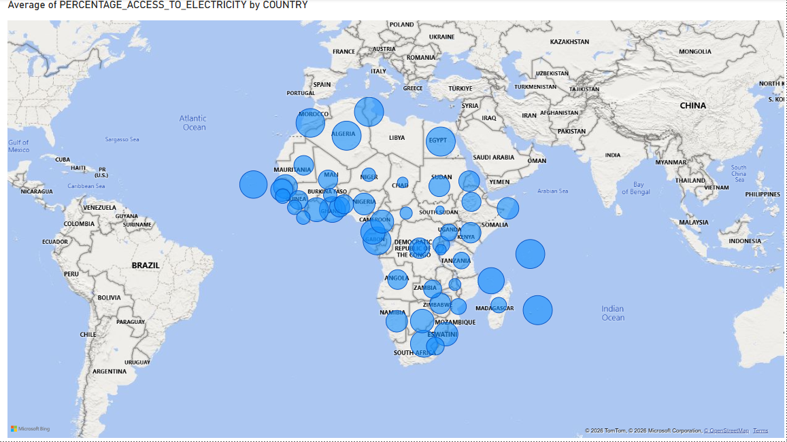
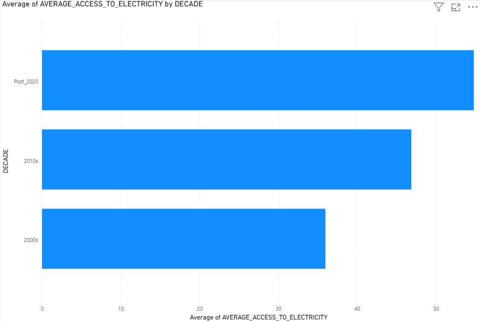

# MBA-BUSINESS-ANALYTICS - Project 1

MBA Portfolio - SQL 
## Project 1 Question: Which African markets present the strongest electricity investment opportunity based on current access gap,
improvement momentum and energy profile?

## Question 1 : Where does each African country stand today on electricity access — and how severe is the gap?
**Data**
[Tbusiness_question_1.csv](Tbusiness_question_1.csv)

**Chart**

[Download PBIX](Project1_BQ1.pbix)

**Code**
[Project1_business_question1.sql](Project1_business_question1.sql)

**Key finding**
Electricity access across Africa is highly inequal: 7 countries have more than 94% access to electricity while 8 have less than 8%. With South Sudan at only 7.2%. There is a large gap between North/Southern Africa and Central/West African countries.
The electricity gap is almost severe in Central Africa and Sahel. 4 Countries are in critical status while Southern Africa show the lowest gap, creating clear "Access divide" across the continent.

## Question 2: Which African Country has improved fastest since 2010 and Which one is stagnating?
**Data**
[Table_Project_1_B2.csv](Table_Project_1_B2.csv)

**Chart**

[Download PowerBI file](Project1_BQ2.pbix)

**Code**
[Project1_business_question2.sql](Project1_business_question2.sql)

**Key finding**
Guinea-Bissau and Liberia have the fastest growth over the last decade at 455.6% and 433.3%, while Somalia was the only country to decline at -4.7%. Moreover, several high-access countries like Mauritius, Tunisia and Egypt are also stagnant because they are already near 100%.

## Question 2: How has the African continent's average electricity access evolved decade by decade — and is the pace of improvement accelerating or slowing?
**Data**
[Table_Project_1_B3.csv](Table_Project_1_B3.csv)

**Chart**

[Download pbix](Project1_B3.pbix)

**Code**
[Project1_B3.sql](Project1_B3.sql)

**Key finding**
Average electricity access in Africa has more than doubled since the 2000s, from around 29% to over 50% post-2020. The pace of improvement is accelerating, with the largest gains occurring in the last 5 years.
