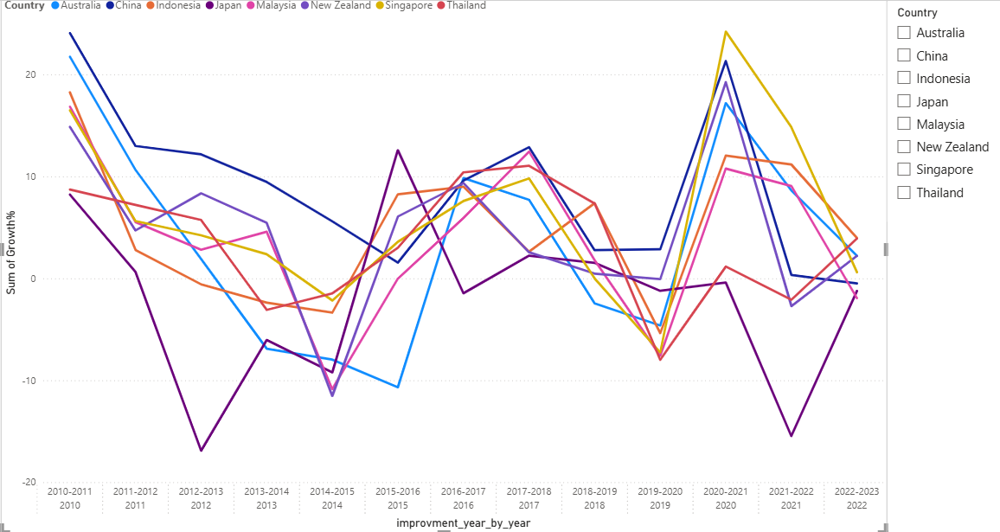
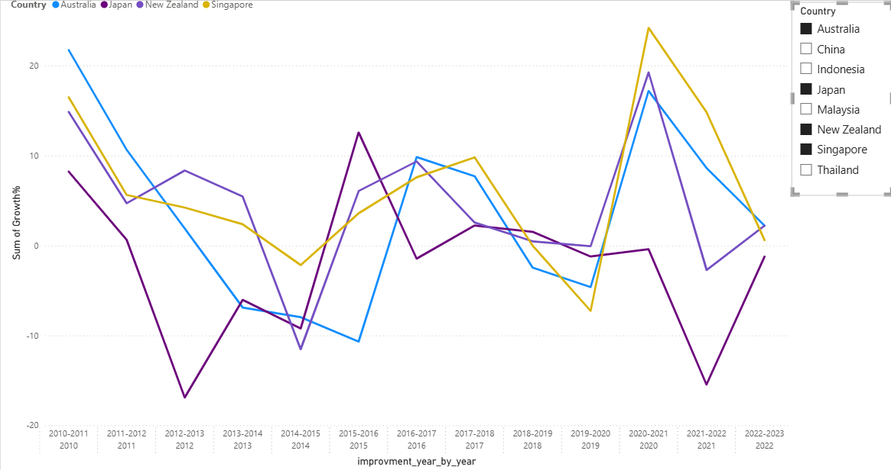
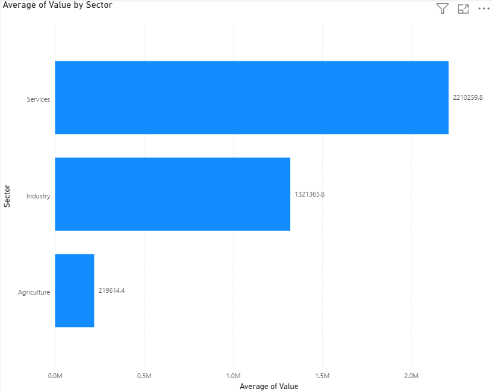

# MBA-Business-Analytics- Project2
MBA Portfolio -SQL + Business case Analysis

## Project 2: Sector Composition and Consulting Demand
**Business question**
Agriculture, Industry, Services GDP across APAC market to identify strongest consulting demand.

**Countries**
Australia, Singapore, Japan and New Zealand  

## Q1: How do Australia, Singapore, Japan and New Zealand rank on total GDP and GDP growth rate over the last decade -and which market is growing fastest? 
**Data**
[Table_BQ1.csv](csv/Table_BQ1.csv)
[Table_BQ1_2.csv](csv/Table_BQ1_2.csv)
**Code**
[SQL Query](code/Project2_4_Business_Question1.sql)
**Chart**

**Key Finding**
Among those four countries, Japan has the highest total GDP with 4204490000000 dollars but over the Last decade, Singapore has the fastest Growth at 38,66 %.
- - - - - - - - - - - - - -  - - - -- - - 

## Q2: Which APAC country improved its GDP most consistently year on year — with fewest years of negative growth since 2010?
**Data**
[Table_BQ2_2.csv](csv/Table_BQ2_2.csv)

**Chart**
[Chart 3](charts/Project2_BQ2.pbix)

**Code**
[Project2_4_Business_Question2.sql](code/Project2_4_Business_Question2.sql)

**Key Finding**
Singapore has the fewest years of negative GDP growth with 2 times values being negative, followed by New Zealand with 3, Australia with 4 and then Japan has t with 8 negative growth values.
**Recommendation**
Singapore is the most stable market for consulting with the least risk whereas Japan shows the highest volatility and should be approached with caution.

## Q3: How does the sector composition: agriculture, industry, services — compare across your four target markets and which has the highest services share signaling strongest consulting demand?
**Data**
[Table_BQ3.csv](csv/Table_BQ3.csv)

**Chart**
[PBIX File](charts/Project2_BQ3.pbix)

**Code**
[Project2_4_Business_Question3.sql](code/Project2_4_Business_Question3.sql)

**Key Finding**
Services sector dominates consulting demand with an average value of 2.21M, nearly two times higher than Industry at 1.32M. Agriculture is the smallest at 0.22M.

**Recommendation**
A consulting firm entering into this APAC market should prioritize Services Sector clients first.

